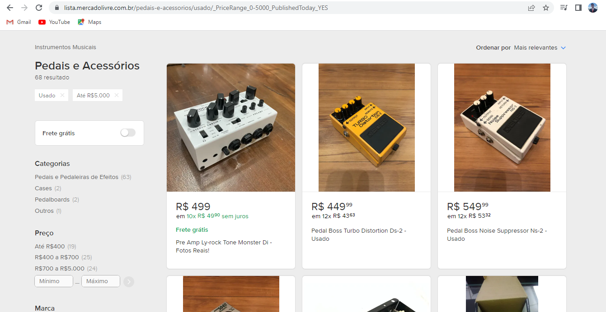
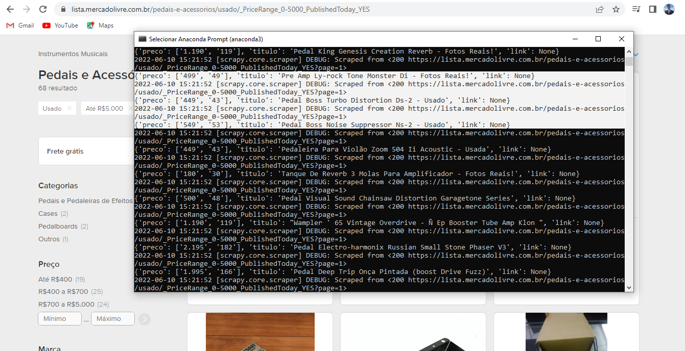
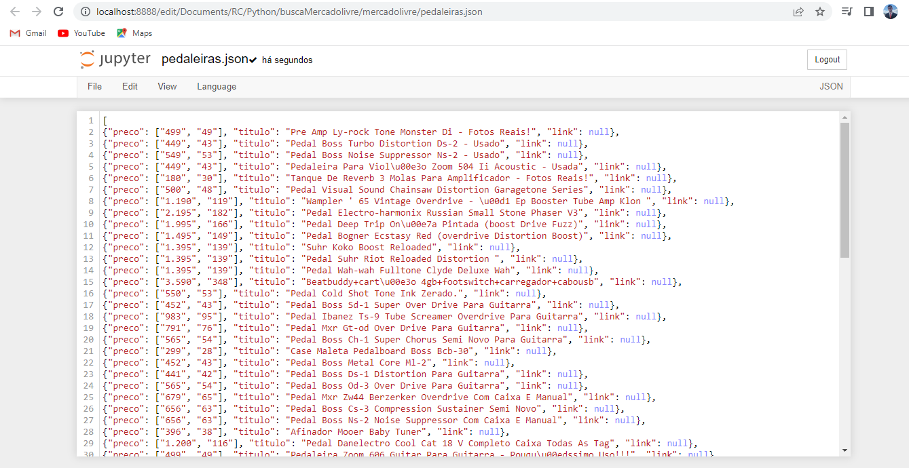

# Web-Scraping-Python

# Descrição
Este projeto consiste na criação de uma aplicação Web Scraping. 
Foi criada uma aplicação onde escolhemos uma página web e pegamos as informações que desejamos desta página.

Por exemplo
Neste projeto fiz a criação de uma aplicação scrapy onde:

<ul>
  <li>Selecionei uma página do mercado livre na categoria pedaleiras.</li>
  <li>Informei qual dados gostaria de capturar daquela página (título do produto, descrição e preço).</li>
  <li>Obtive todas as informações que solicitei no prompt do anaconda.</li>
  <li>Salvei as informações em um arquivo JSON.</li>
</ul>

Sendo uma ótima ferramenta para automoção de processos, podendo filtrar e catalogar milhares de produtos em poucos segundos.

# Layout do Projeto

  
  
  

# Tecnologias Utilizadas

<ul>
  <li>Python</li>
  <li>Scrapy</li>
  <li>Anaconda Prompt</li>
  <li>Jupyter Notebook</li>
  </ul>

# Autor
José Ricardo Chies Gonçalves

LinkedIn:
https://www.linkedin.com/in/ricardo-chies-087557216/

E-mail:
chies.dev@gmail.com
